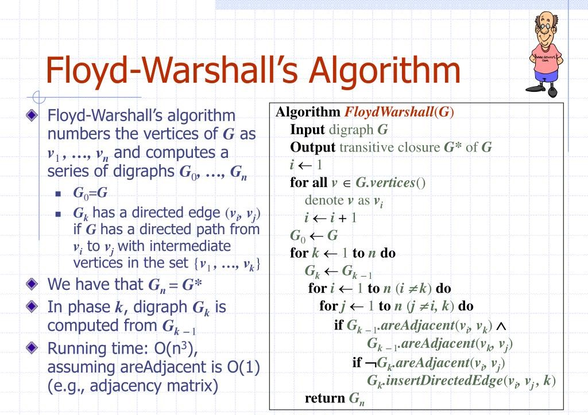
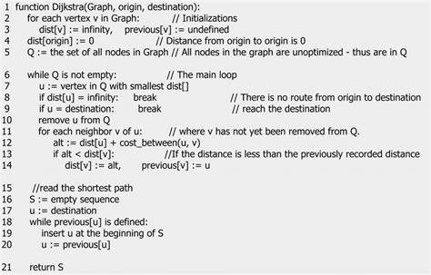
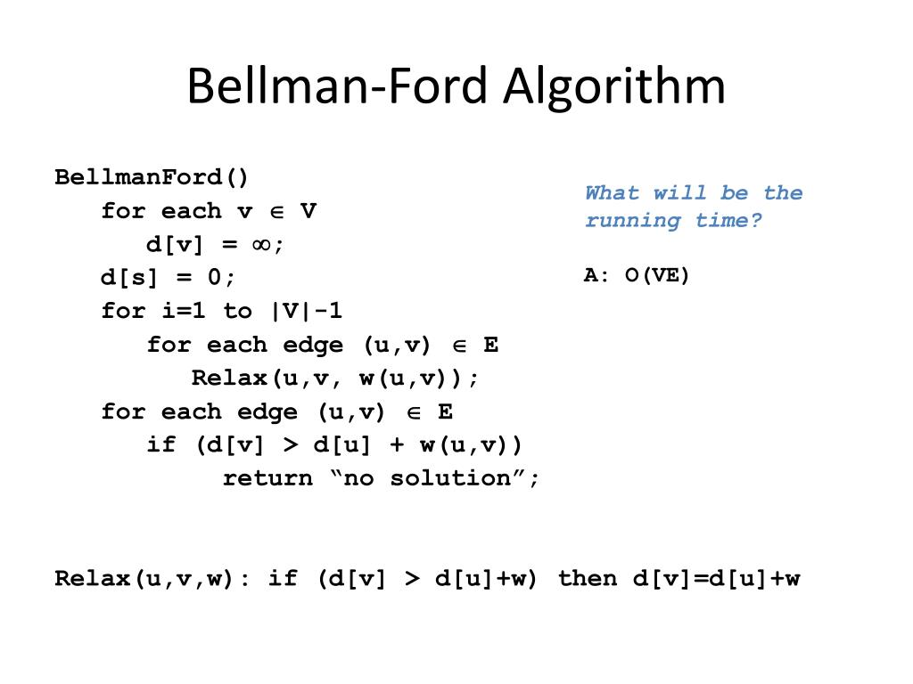
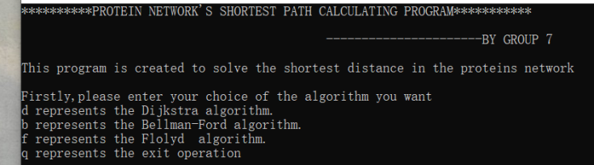
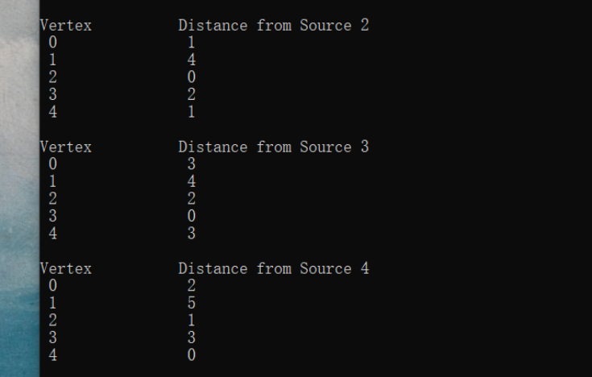

# Biocomputing programming language

## Introduction

This project is the final project of my undergraduate course: Biocomputational Programming Language (C). Its topic is: implementing protein networks and shortest path computations

## Background

Protein-Protein Interaction Networks (PPIs) are composed of proteins that interact with each other to participate in various aspects of life processes, such as biological signalling, gene expression regulation, energy and material metabolism, and cell cycle regulation. Systematic analysis of the interactions of a large number of proteins in biological systems is important for understanding the workings of proteins in biological systems, the response mechanisms of biological signals and energy and material metabolism in special physiological states such as diseases, as well as the functional connections between proteins. In the protein interaction network, the shortest distance between two proteins may represent the biological connection between them; therefore the information obtained in this network can be used to analyse the obtained proteins in some bioinformatic directions  

## Main process

Firstly, we introduce protein-related data through interactive input or file parsing, and then we try to construct a protein network using graph data structure. Then, we try to find the shortest path from each protein to other proteins in the network by various graph shortest path algorithms, including:

+ Floyd-Warshall Algorithm

  The main idea of the algorithm is shown below:

  

+ Dijkstra algorithm

  The pseudo-code is shown below:

  

+ Bellman-Ford algorithm

  The pseudo-code is shown below:

  

## Introduction to the main document

### `Midterm Report`

This folder contains mainly the optional topics for the final project of the course (`Alternative projects.md`) and our group's midterm report (`Introduction and plans.pdf`). In our midterm report PPT, we give a detailed background on our project topic as well as the algorithms and staffing arrangements we intend to use.

### `Final`.

In this folder, it mainly contains the core code files of the project (`main.cpp`, `function.cpp`, `lib.h`, etc.) as well as the content related to the project summary (including user manual `MANUAL.pdf`, summary report `Summary Report.pdf`, presentation video `Report Video.mp4 etc.).

The following is the user input screen:

The following is the output of a particular run:

## Summary

### Time complexity

First of all, we can know that the algorithms with higher time complexity are `Floyd-Warshall Algorithm` and `Bellman-Ford algorithm`, because the former uses a violent solution using triple loops, which makes the time complexity O(n\^3); while the latter's time is O(V*E), where V is the number of elements and E is the number of edges: in our array implementation, the time complexity is O(n^2), while it can actually reach O (ElogV). As for the space complexity, the `Floyd-Warshall Algorithm` consumes little memory other than storing the shortest distance matrix, while the `Bellman-Ford algorithm` and the `Dijkstra algorithm` store a lot of auxiliary information (distance vectors, neighbours matrices, ifwork matrix, etc.) for computation, their space complexity is significantly higher.

### Algorithmic robustness

When analysed in terms of coping with the occurrence of errors, changes, etc., it is known that the programs implemented through the `Floyd-Warshall Algorithm` and the `Dijkstra algorithm` are able to reduce the impact of the error when it encounters an error or a change, as each node is independently and saturated with computation when both are carried out, and there exists the possibility of fixing the error,. At the same time the error does not spread. Whereas, according to the theoretical analysis it can be seen that if an error occurs in the `Bellman-Ford algorithm`, the error will spread to all the nodes; in addition the algorithm suffers from the infinite counting problem: this problem means that if the network reaches the equilibrium and then there is an increase in the distance and so on, the `Bellman-Ford algorithm` has to spend multiple loop iterations to correct all the distance vectors, especially when the changes are prominent, the time spent is uncountable, this problem further increases the time complexity of the `Bellman-Ford algorithm` and reduces its ability to cope with changes in the network.

# 生物计算编程语言

## 介绍
该项目是我的本科课程：生物计算编程语言（C）的期末项目。其主题是：实现蛋白质网络及最短路径的计算

## 背景

蛋白质互作网络（Protein-Protein Interaction Networks， PPI）是由蛋白通过彼此之间的相互作用构成，来参与生物信号传递、基因表达调节、能量和物质代谢及细胞周期调控等生命过程的各个环节。系统分析大量蛋白在生物系统中的相互作用关系，对了解生物系统中蛋白质的工作原理，了解疾病等特殊生理状态下生物信号和能量物质代谢的反应机制，以及了解蛋白之间的功能联系都有重要意义。在蛋白质互作网络中，两个蛋白质之间的最短距离可能代表着他们之间的生物学联系；因此通过该网络中所得到的信息可以对所得到的蛋白进行一些生物信息方向的分析  

## 主要流程
首先，我们通过交互输入或是文件解析的方式引入蛋白质相关数据，之后，我们尝试使用图的数据结构构建一个蛋白质的网络。然后，我们尝试通过多种图的最短路径算法求得网络中每一个蛋白质到其他蛋白质的最短路径，包括：

+ Floyd-Warshall Algorithm

  其主要算法思想如下所示：

  

+ Dijkstra algorithm

  其伪代码如下所示：

  

+ Bellman-Ford algorithm

  其伪代码如下：

  

## 主要文件介绍

### `Midterm Report`

在该文件夹中，主要包含了该课程期末项目的可选主题（`Alternative projects.md`）以及我们小组的中期报告（`Introduction and plans.pdf`）。在我们的中期报告PPT中，我们详细介绍了我们的项目主题背景以及我们准备使用的算法和人员安排。

### `Final`

在该文件夹中，主要包含了项目核心代码文件（`main.cpp`、`function.cpp`、`lib.h`等）以及项目总结相关内容（包括用户手册`MANUAL.pdf`、总结报告`Summary Report.pdf`、展示视频`Report Video.mp4`等）。

如下是用户输入界面：

如下是某次运行的输出：

## 总结

### 时空复杂度

首先可以知道时间复杂度较高的算法为`Floyd-Warshall Algorithm`和` Bellman-Ford algorithm`，因为前者使用了暴力的求解方式使用了三重循环，使得时间复杂度为O(n\^3)；而后者的时间度则为O(V*E)，V为元素个数，E为边个数：在我们的数组实现中，其时间复杂度为O(n^2)，而其实可以达到O (ElogV)。而对于空间复杂度方面，`Floyd-Warshall Algorithm`除了储存了最短距离矩阵之外，就几乎没有其他的内存消耗；而`Bellman-Ford algorithm`和`Dijkstra algorithm`则储存了大量辅助信息（距离向量、邻居矩阵、ifwork矩阵等）进行计算，其空间复杂明显更高。

### 算法稳健性

从应对发生错误、变化等方面进行分析，可以知道通过`Floyd-Warshall Algorithm`和`Dijkstra algorithm`实现的程序在遇到错误或变化时能够减少错误的影响力，因为在这两者进行时每个节点是独立、饱和的进行计算，存在修复错误的可能，同时错误不会扩散。而根据理论分析可知`Bellman-Ford algorithm`中如果出现错误，错误将会扩散至所有节点；此外该算法还存在着无穷计数问题：该问题是指如果该网络达到平衡后又出现距离增加等问题时，`Bellman-Ford algorithm`必须花费多个循环迭代才能修正所有距离向量的问题，尤其是当变化突出时，花费的时间是难以计数的，这一问题进一步增加了`Bellman-Ford algorithm`的时间复杂度，也降低了其在遭遇网络改变时的应对力。

